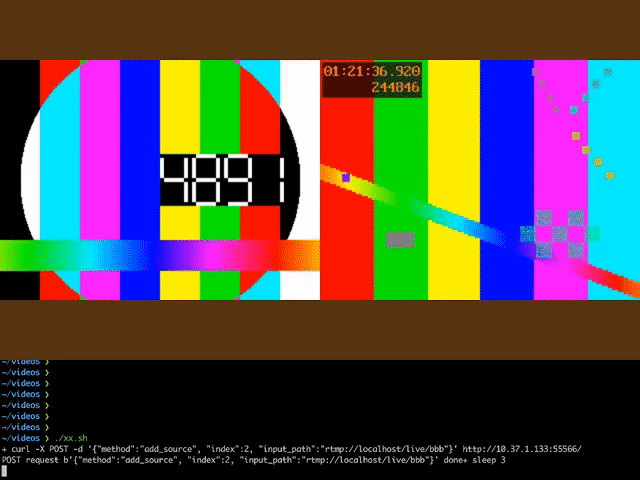
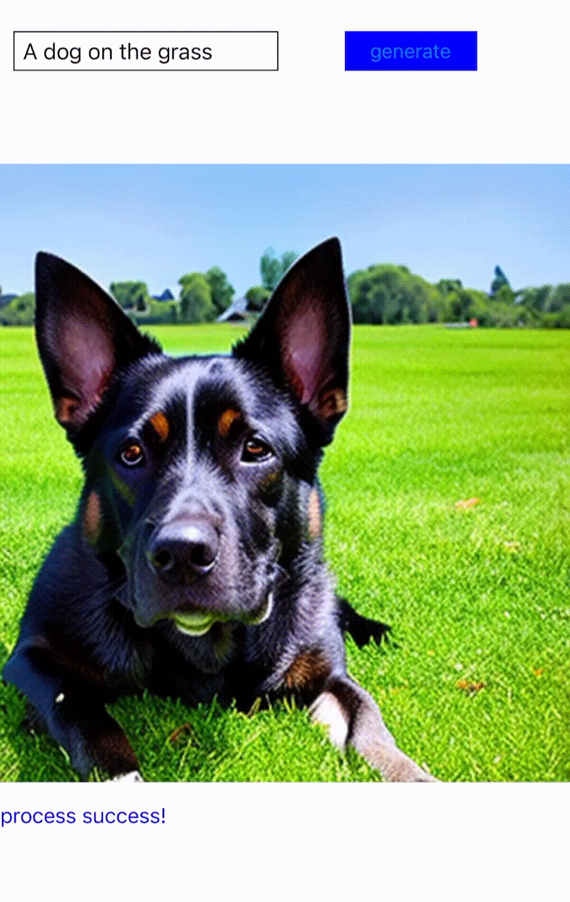

在本节中，我们将围绕六个维度直接展示 BMF 框架的功能： **转码**、 **编辑** 、 **会议/广播**、**GPU 加速** 、**AI 推理和客户端框架** 。对于下面提供的所有演示，Google Colab 上提供了相应的实现和文档，让您直观地体验它们。

### 转码
本 demo 将逐步介绍如何使用 BMF 开发转码程序，包括视频转码、音频转码和图像转码。您可以从中熟悉如何使用 BMF，以及如何使用与 FFmpeg 兼容的选项来实现所需的能力。

快速体验：

### 编辑
本 demo 展示了如何通过BMF框架实现高复杂度的音频和视频编辑 pipeline。我们实现了 video_concat 和 video_overlay 两个 Python 模块，并结合各种原子能力构建了一个复杂的 BMF Graph。

快速体验：

### 会议/广播
本 demo 使用 BMF 框架构建一个简单的导播服务。该服务提供的 API 可实现动态视频拉取、视频布局控制、音频混合，并最终将输出流式传输到 RTMP 服务器。本 demo 展示了 BMF 的模块化、多语言开发以及动态调整 pipeline 的能力。

下方是一个导播操作的录频演示：

### GPU 加速
#### 视频帧提取
视频帧提取加速 demo 展示：
1. BMF 的灵活能力：

   *   多语言编程，在这个 demo 中我们可以看见多语言模块协同工作
   *   易于扩展，可以轻松添加新的 Python、C++ 模块
   *   完全兼容 FFmpeg

2. 支持快速硬件加速以及 CPU/GPU pipeline

   *   BMF 支持异构 pipeline，例如 CPU 和 GPU 之间的进程
   *   BMF 具有有用的硬件 color space conversion 能力
快速体验：

#### GPU 视频转码和过滤
GPU 转码和 filter 模块 demo 展示了：
1. 由 GPU 加速的 BMF 中常见的视频/图像 filter
2. 如何写 BMF 的 GPU 模块

本 demo 构建了一个完全在 GPU 上运行的转码 pipeline：

decode->scale->flip->rotate->crop->blur->encode

快速体验：

### AI 推理
#### LLM 预处理
如何在 Bytedance 中为 LLM 训练数据构建视频预处理的[prototype]() ，每天为数十亿个剪辑处理提供服务。
输入的视频会根据场景变化进行分割，视频中的字幕会被 OCR 模块检测和裁剪，视频质量会由 BMF 提供的美学模块进行评估。之后，最终的视频剪辑将被编码为输出。
#### Deoldify
本 demo 展示了如何将最先进的 AI 算法集成到 BMF 的视频处理 pipeline。著名的开源着色算法 [DeOldify](https://github.com/jantic/DeOldify) 被封装在 BMF Python 模块，代码不到 100 行。最终的效果如下图所示，左边是原视频，右边是彩色视频：

快速体验： 

#### 超分辨率
本 demo 将 [Real-ESRGAN](https://github.com/xinntao/Real-ESRGAN) 的超分辨率推理过程实现为 BMF 模块，展示了一个结合解码、超分辨率推理和编码的 BMF pipeline。

快速体验： 

 #### 超分辨率
此演示将[Real-ESRGAN](https://github.com/xinntao/Real-ESRGAN)的超分辨率推理过程实现为 BMF 模块，展示了一个结合了解码、超分辨率推理和编码的 BMF 管道。

快速体验： 

#### 视频质量打分
本 demo 展示了如何使用 BMF 调用美学评估模型。深度学习模型 Aesmode 在 AVA 数据集上的二元分类准确率达到了 83.8%，达到学术届 SOTA 的水平，并且可以通过帧提取处理直接用于评估视频的美学程度。

快速体验：

#### 使用 TensorRT 进行人脸检测
本 demo 展示了一个基于 **TensorRT** 加速的全链路人脸检测 pipeline，其内部使用 TensorRT 加速的 Onnx 模型来处理输入视频。它使用 NMS 算法过滤重复的候选框，形成输出，可用于高效处理**人脸检测**任务。

快速体验：

### 客户端框架
####  边缘 AI 模型
本案例说明了将外部算法模块集成到 BMFLite 框架中的过程及其执行管理。

#### 实时降噪
此示例将降噪算法实现为 BMF 模块，展示了一个结合了视频捕获、降噪和渲染的 BMF 管道。

## Acknowledgment## Table of Contents

- [About BMF](https://babitmf.github.io/about/)

- [Quick Experience](#quick-experience)
  - [Transcode](#transcode)
  - [Edit](#edit)
  - [Meeting/Broadcaster](#meetingbroadcaster)
  - [GPU acceleration](#gpu-acceleration)
    - [GPU Video Frame Extraction](#gpu-video-frame-extraction)
    - [GPU Video Transcoding and Filtering](#gpu-video-transcoding-and-filtering)
  - [AI Inference](#ai-inference)
    - [Deoldify](#deoldify)
    - [Super Resolution](#super-resolution)
    - [Video Quality Score](#video-quality-score)
    - [Face Detect With TensorRT](#face-detect-with-tensorrt)

- [Getting Started](https://babitmf.github.io/docs/bmf/getting_started_yourself/)
  - [Install](https://babitmf.github.io/docs/bmf/getting_started_yourself/install/)
  - [Create a Graph](https://babitmf.github.io/docs/bmf/getting_started_yourself/create_a_graph/)
    - one of transcode example with 3 languages
  - [Use Module Directly](https://babitmf.github.io/docs/bmf/getting_started_yourself/use_module_directly/)
    - sync mode with 3 languages. You can try it on:

      Python:
      C++:
      Go:
  - [Create a Module](https://babitmf.github.io/docs/bmf/getting_started_yourself/create_a_module/)
    - customize module with python, C++ and Go. You can try it on 

- [Multiple Features (with examples)](https://babitmf.github.io/docs/bmf/multiple_features/)
  - [Graph Mode](https://babitmf.github.io/docs/bmf/multiple_features/graph_mode/)
    - [Generator Mode](https://babitmf.github.io/docs/bmf/multiple_features/graph_mode/generatemode/)
    - [Sync Mode](https://babitmf.github.io/docs/bmf/multiple_features/graph_mode/syncmode/)
    - [Server Mode](https://babitmf.github.io/docs/bmf/multiple_features/graph_mode/servermode/)
    - [Preload Mode](https://babitmf.github.io/docs/bmf/multiple_features/graph_mode/preloadmode/)
    - [Subgraph](https://babitmf.github.io/docs/bmf/multiple_features/graph_mode/subgraphmode/)
    - [PushData Mode](https://babitmf.github.io/docs/bmf/multiple_features/graph_mode/pushdatamode/)
  - [FFmpeg Fully Compatible](https://babitmf.github.io/docs/bmf/multiple_features/ffmpeg_fully_compatible/)
  - [Data Convert Backend](https://babitmf.github.io/docs/bmf/multiple_features/data_backend/)
  - [Dynamic Graph](https://babitmf.github.io/docs/bmf/multiple_features/dynamic_graph/)
  - [GPU Hardware Acceleration](https://babitmf.github.io/docs/bmf/multiple_features/gpu_hardware_acc/)
  - [BMF Tools](https://babitmf.github.io/docs/bmf/multiple_features/tools/)

- [APIs](https://babitmf.github.io/docs/bmf/api/)
  - [API in Python](https://babitmf.github.io/docs/bmf/api/api_in_python/)
  - [API in Cpp](https://babitmf.github.io/docs/bmf/api/api_in_cpp/)
  - [API in Go](https://babitmf.github.io/docs/bmf/api/api_in_go/)

- [License](#license)
- [Contributing](#contributing)

## 许可证
该项目具有[Apache 2.0 License](https://github.com/BabitMF/bmf/blob/master/LICENSE)许可证 。第三方组件和依赖项仍采用自己的许可证。

## 贡献
欢迎贡献。请遵循[guidelines](https://github.com/BabitMF/bmf/blob/master/CONTRIBUTING.md).
我们使用 GitHub 问题来跟踪和解决问题。如果您有任何问题，请随时加入讨论并与我们一起寻找解决方案。

## 确认
解码器、编码器和滤波器引用[ffmpeg cmdline tool](http://ffmpeg.org/)工具 。它们被包装为 LGPL 许可下的 BMF 内置模块。
该项目还从其他流行的框架中汲取灵感，例如  [ffmpeg-python](https://github.com/kkroening/ffmpeg-python) 和[mediapipe](https://github.com/google/mediapipe)。 我们的 [website](https://babitmf.github.io/)正在使用基于[hugo](https://github.com/gohugoio/hugo) 的 [docsy](https://github.com/google/docsy)项目。

在此，我们向上述项目的开发者表示最诚挚的感谢！

